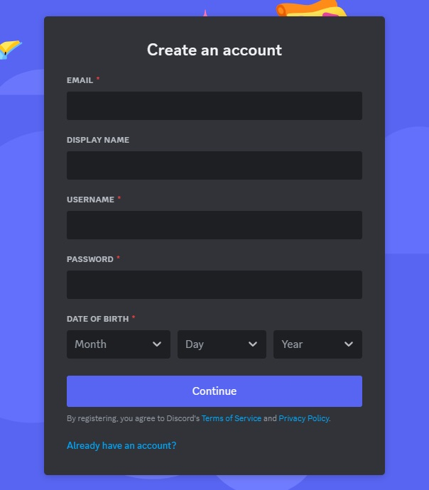
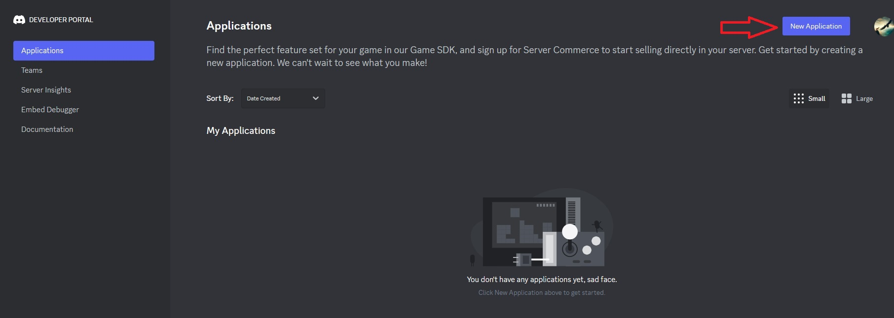
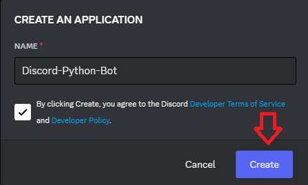
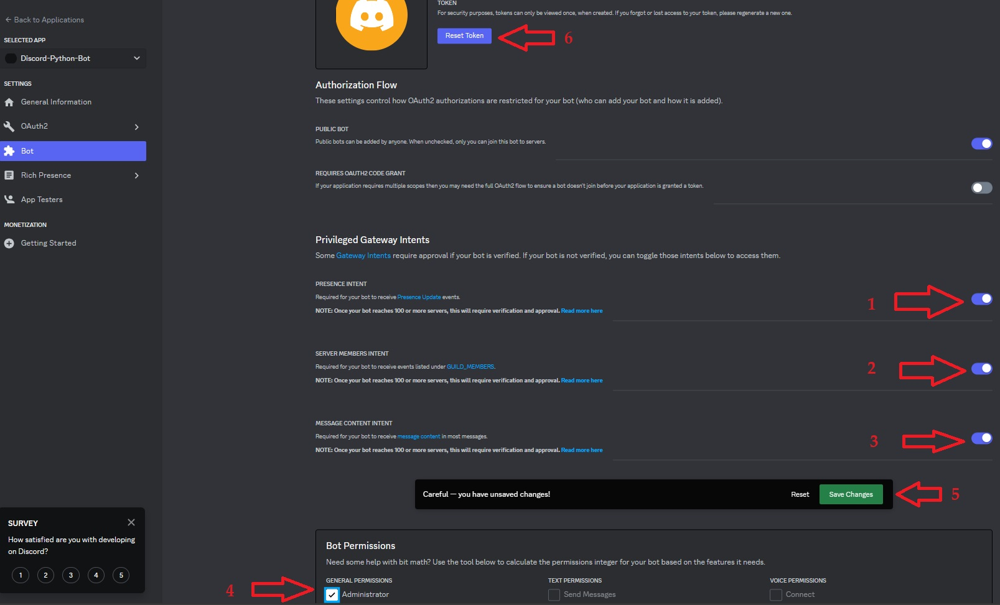
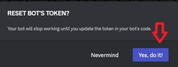
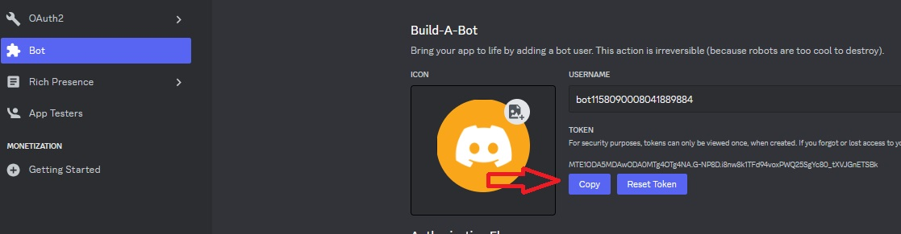
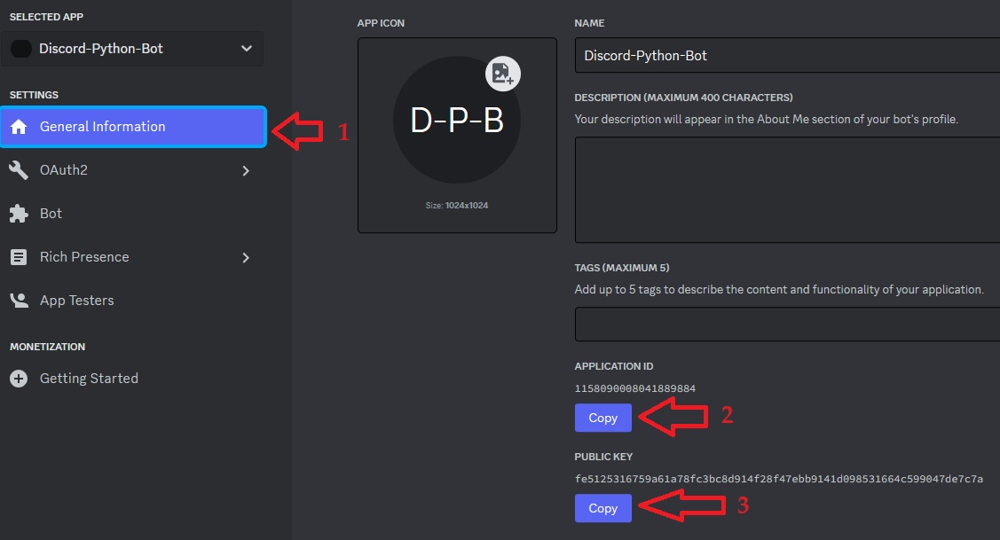
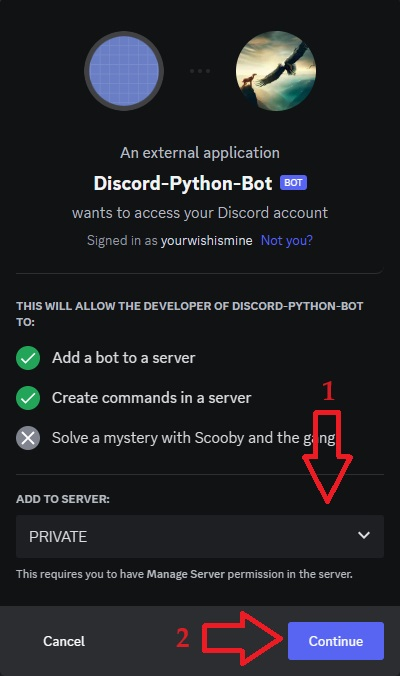
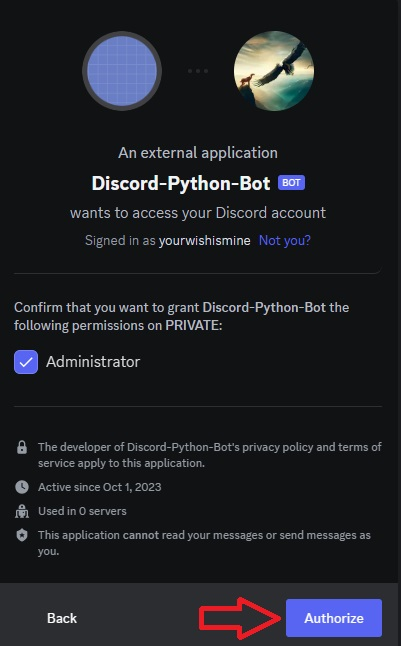

# Discord-Bot-Tipping-Python
A Discord Tipping bot written in Python
* Make Discord account if you don't have one already.
<!-- links -->
>> [Discord - Register a new account](https://discord.com/register)
<!--Images-->

* Goto to the Discord Developer Portal and click ***New Application***
<!-- links -->
>> [Discord - Developer Portal](https://discord.com/developers/applications)
<!--Images-->

* NAME your bot, Check the box and click ***Create***
<!--Images-->

* Click ***Bot*** on the left
<!--Ordered List -->
>>1. PRESENCE INTENT (toggle on)
>>2. SERVERS MEMBERS INTENT (toggle on)
>>3. MESSAGE CONTENT INTENT (toggle on)
>>4. Administrator (check box)
>>5. Save Changes
>>6. Reset Token
<!--Images-->

* Click ***Yes, do it!***
<!--Images-->

<!-- links -->
>> [Install Scoop](https://scoop.sh/)
* in a Terminal window - right-click -> Run as administrator
<!-- PowerShell script block -->
```powershell
scoop install git
scoop bucket add extras
scoop install mysql-lts
scoop install mysql-workbench
scoop install python
scoop install vscode
scoop install pwsh
mysqld --install
mysqld --initialize
Start-Service -Name MySQL
mysql --user root
CREATE USER 'pydiscbot'@'localhost' IDENTIFIED BY 'MySuperGoodPassword';
GRANT CREATE, ALTER, DROP, INSERT, UPDATE, DELETE, SELECT, REFERENCES, RELOAD on *.* TO 'pydiscbot'@'localhost' WITH GRANT OPTION;
FLUSH PRIVILEGES;
SHOW GRANTS FOR 'pydiscbot'@'localhost';
exit;
git clone https://github.com/yourwishismine1989/Discord-Bot-Tipping-Python.git
Set-Location -Path .\Discord-Bot-Tipping-Python
Copy-Item -Path .\.env_example -Destination .\.env
code .\.env
```
* In the Discord Developer Portal click ***Copy*** to copy your bot's private TOKEN (always keep this private)
<!--Images-->

* in vscode
```
# .env
TOKEN = '<paste your copied token here>'
```
* In the Discord Developer Portal
<!--Ordered List -->
>>1. click ***OAuth2***
>>2. click ***URL Generator***
>>3. click ***bot***
>>4. check the ***Administrator*** check box
>>5. click ***Copy***
<!--Images-->

* in vscode
```
# .env
TOKEN = '<paste your copied token here>'
INVITEURL = '<paste the copied URL here>'
```
* open a new TAB in your Web-Browser and paste the copied URL in the Address bar of the new TAB (don't press ENTER)
* click back to the Discord Developer Portal TAB
* In the Discord Developer Portal (see image below showing steps in Developer Portal)
<!--Ordered List -->
>>1. click ***General Information***
>>2. click ***Copy*** button under ***APPLICATION ID***
* in vscode
```
# .env
TOKEN = '<paste your copied token here>'
INVITEURL = '<paste the copied URL here>'
APPLICATIONID = '<paste copied APPICATION ID here>'
```
* In the Discord Developer Portal
>>3. click ***Copy*** button under ***PUBLIC_KEY***
* in vscode
```
# .env
TOKEN = '<paste your copied token here>'
INVITEURL = '<paste the copied URL here>'
APPLICATIONID = '<paste copied APPICATION ID here>'
PUBLICKEY = '<paste your copied PUBLIC_KEY here>'
MYSQLUSER = 'pydiscbot'
MYSQLPASSWORD = 'MySuperGoodPassword'
MYSQLDATABASE = 'pythondiscdb'
MYSQLHOST = 'localhost'
BOTOWNER = '<YourDiscordID>'
BOTCURRENCY = 'TippingBotCoin'
```
>>4. CTRL+S
<!--Images-->

* Create a Discord Server (also known as a Guild)
<!-- links -->
>> [Discord - Create a server](https://support.discord.com/hc/en-us/articles/204849977-How-do-I-create-a-server-)
* click the new TAB you opened earlier in your Web-Browser and click enter on the Address you pasted in the Address bar
>> Choose your server from the Drop-Down box then click ***Continue***
<!--Images-->

>> Click ***Authorize***
<!--Images-->

* The bot should now be OFFLINE on your server
<!--Images-->

* back in the terminal
<!-- PowerShell script block -->
```powershell
python -m venv ./
pip install --upgrade autopep8
pip install --upgrade python-dotenv
pip install --upgrade discord.py
pip install --upgrade PyMySQL
pip install --upgrade PyMySQL[rsa]
python bot.py
```
### Congratulations, You now have a Discord tipping bot written in Python
#### Notes
<!-- links -->
* [Discord - Developer Docs](https://discord.com/developers/docs/intro)
* [Discord - Developer Server](https://discord.gg/discord-developers)
* [Discord Intents Calculator](https://discord-intents-calculator.vercel.app)
* [discord.py](https://discordpy.readthedocs.io/en/latest/)
* Tested on Windows 11 on 2023-10-05
<!-- links -->
* [Visual Studio Code (VSCode)](https://code.visualstudio.com/download)
* This isn't meant to be a Python course, for an introductory Python Course see the link below
<!-- links -->
* [Programming with Mosh - Python for Beginners](https://www.youtube.com/watch?v=kqtD5dpn9C8)
* For getting Python setup on your Computer, see my Getting Started tutorial here
<!-- links -->
* [Python - Getting Started](https://github.com/yourwishismine1989/Python_Getting-Started)